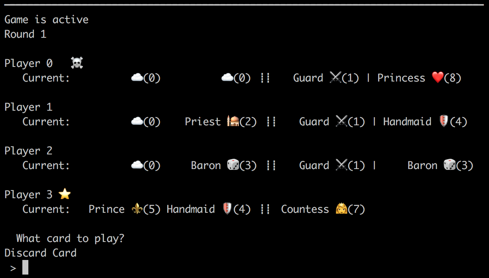

# Love Letter

Simulator and Agents for the game of [Love Letter](https://www.boardgamegeek.com/boardgame/129622/love-letter).

Love Letter is a turn based card game where a player wins by eliminating the other players.

Requirements are contained in `requirements.txt`. Install with `pip install -r requirements.txt`.

## Console Play

Run with `python play.py`.

## Tests

Run with `make test`, `python loveletter/setup.py test`, or `python -m unittest discover`.