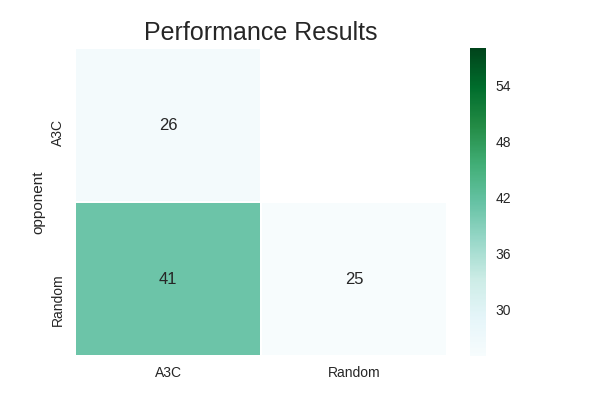

# Love Letter

Simulator and Agents for the game of [Love Letter](https://www.boardgamegeek.com/boardgame/129622/love-letter).

Love Letter is a turn based card game where a player wins by eliminating the other players.

## Agents

Numbers match the win rate of the agent on the bottom row against the opponent agent in the left column. Darker colors are better - the best agent has the column of darkest colors. Note these are all based on four player games, so a random agent will win 25% of the time against three other random agents.

### Random Agent

This agent chooses from valid actions randomly every time.

### Asynchronous Advantage Actor-Critic (A3C)

Based on a system covered in the paper [Asynchronous Methods for Deep Reinforcement Learning](https://arxiv.org/pdf/1602.01783.pdf), this system involves multiple neural networks updating based on experienced episodes.

## Console Play

Run with `python play.py`.

## Installation

Requirements are contained in `requirements.txt`. Install with `pip install -r requirements.txt`.

## Tests

Run with `make test`, `python loveletter/setup.py test`, or `python -m unittest discover`.
